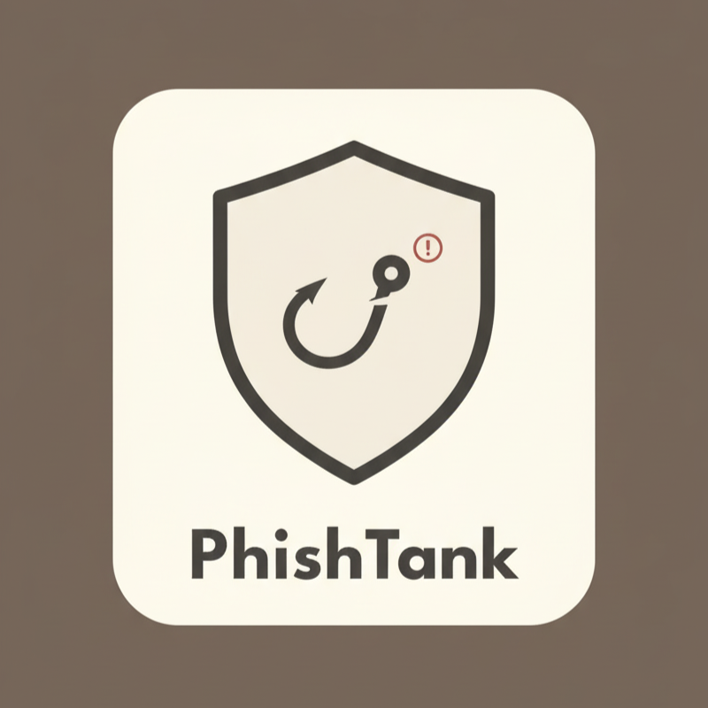

# 🛡️ PhishTank - Advanced Phishing Detection System

<div align="center">



**A comprehensive AI-powered solution to detect and prevent phishing attacks through URLs and emails**

[](https://www.python.org/downloads/)
[](https://fastapi.tiangolo.com/)
[](https://developer.chrome.com/docs/extensions/)

</div>

---

## 📋 Table of Contents

- [Overview](#-overview)
- [Features](#-features)
- [Architecture](#-architecture)
- [Tech Stack](#-tech-stack)
- [Installation](#-installation)
- [Usage](#-usage)
- [Machine Learning Models](#-machine-learning-models)
- [API Documentation](#-api-documentation)
- [Browser Extension](#-browser-extension)
- [Datasets](#-datasets)
- [Results & Performance](#-results--performance)
- [UI](#-ui)
- [Team](#-team)

---

## 🎯 Overview

**PhishTank** is an intelligent phishing detection system that combines machine learning with real-time protection. It provides a dual-layer defense mechanism:

1. **URL Phishing Detection** - Analyzes suspicious URLs using Logistic Regression with TF-IDF vectorization
2. **Email Phishing Detection** - Examines email content using DistilBERT transformer model

The system is accessible through:
- 🌐 **Browser Extension** - Real-time URL scanning while browsing
- 🚀 **REST API** - Integration with any application or service
- 📊 **Jupyter Notebooks** - Model training and experimentation

---

## ✨ Features

### 🔗 URL Phishing Detection
- **Real-time URL scanning** as you browse
- **Character-level analysis** using TF-IDF with n-grams (3-5)
- **High accuracy** logistic regression classifier
- **Instant notifications** for suspicious websites
- **Visual indicators** (red/green badges) for safety status

### 📧 Email Phishing Detection
- **Deep learning-based** email content analysis
- **DistilBERT transformer** for contextual understanding
- **Multi-source training** on diverse phishing datasets
- **Sender, subject, and body** comprehensive analysis
- **Confidence scores** for prediction reliability

### 🎨 User Interface
- Clean and intuitive popup interface
- Easy-to-understand threat indicators
- Detailed analysis results
- Privacy-focused design

---

## 🏗️ Architecture

```
PhishTank/
├── 🔌 Browser Extension (Frontend)
│   ├── manifest.json          # Extension configuration
│   ├── background.js           # Service worker
│   ├── content.js             # Page content analyzer
│   ├── ui.js                  # UI logic
│   ├── index.html             # Popup interface
│   └── style.css              # Styling
│
├── 🚀 Backend (API Server)
│   ├── app.py                 # FastAPI application
│   ├── requirements.txt       # Python dependencies
│   ├── url/                   # URL detection module
│   │   └── logreg_phishing_model/
│   └── email/                 # Email detection module
│       └── distilbert_phishing_model/
│
└── 📊 Machine Learning
    ├── URL_Phishing_Detection.ipynb
    └── phishing_email_analysis_bert.ipynb
```

---

## 🛠️ Tech Stack

### Machine Learning & AI
- **Python 3.8+** - Core programming language
- **scikit-learn** - URL classification (Logistic Regression)
- **Transformers (Hugging Face)** - Email classification (DistilBERT)
- **PyTorch** - Deep learning framework
- **TF-IDF Vectorization** - Feature extraction for URLs

### Backend
- **FastAPI** - High-performance REST API
- **Pydantic** - Data validation
- **Joblib** - Model serialization

### Frontend
- **JavaScript (ES6+)** - Extension logic
- **HTML5/CSS3** - User interface
- **Chrome Extension API** - Browser integration

### Data Analysis
- **Pandas** - Data manipulation
- **NumPy** - Numerical computing
- **Matplotlib/Seaborn** - Visualization

---

## 📥 Installation

### Prerequisites
- Python 3.8 or higher
- Node.js (optional, for development)
- Chrome/Edge browser (for extension)

### 1. Clone the Repository
```bash
git clone https://github.com/yourusername/PhishTank.git
cd PhishTank
```

### 2. Set Up Backend

#### Install Python Dependencies
```bash
cd backend
pip install -r requirements.txt
```

#### Download Pre-trained Models
The models should be in:
- `backend/url/logreg_phishing_model/` - URL detection model
- `backend/email/distilbert_phishing_model/` - Email detection model

#### Start the API Server
```bash
python app.py
```

The API will be available at `http://localhost:8000`

### 3. Install Browser Extension

1. Open Chrome/Edge browser
2. Navigate to `chrome://extensions/` (or `edge://extensions/`)
3. Enable "Developer mode"
4. Click "Load unpacked"
5. Select the `PhishTank` directory
6. The extension icon will appear in your toolbar

---

## 🚀 Usage

### Browser Extension

1. **Automatic Protection**: The extension automatically scans URLs as you browse
2. **Manual Check**: Click the extension icon to manually check the current page
3. **View Results**: Green badge = Safe, Red badge = Phishing detected
4. **Notifications**: Receive instant alerts for suspicious websites

### API Endpoints

#### 1. Check URL for Phishing
```bash
POST http://localhost:8000/predict/url
Content-Type: application/json

{
  "url": "https://example-suspicious-site.com"
}
```

**Response:**
```json
{
  "url": "https://example-suspicious-site.com",
  "prediction": "phishing",
  "label": 1,
  "timestamp": "2025-10-12T10:30:00"
}
```

#### 2. Check Email for Phishing
```bash
POST http://localhost:8000/predict/email
Content-Type: application/json

{
  "sender": "noreply@suspicious.com",
  "subject": "Urgent: Verify your account",
  "body": "Dear user, click here to verify..."
}
```

**Response:**
```json
{
  "prediction": "phishing",
  "confidence": 0.95,
  "label": 1,
  "processed_date": "2025-10-12T10:30:00"
}
```

#### 3. Health Check
```bash
GET http://localhost:8000/health
```

---

## 🤖 Machine Learning Models

### 1. URL Phishing Detection Model

**Algorithm**: Logistic Regression with TF-IDF Vectorization

**Features**:
- Character-level n-grams (3-5) capture URL patterns
- 5000 most important features
- TF-IDF weighting for feature importance

**Training Process**:
```python
# Feature extraction
vectorizer = TfidfVectorizer(
    max_features=5000,
    analyzer='char_wb',
    ngram_range=(3, 5)
)

# Model training
model = LogisticRegression(max_iter=200)
model.fit(X_train, y_train)
```

**Why This Works**:
- URLs have distinctive character patterns
- Phishing URLs often use character substitutions (e.g., "paypa1.com")
- N-grams capture these subtle variations

### 2. Email Phishing Detection Model

**Algorithm**: DistilBERT (Distilled BERT)

**Architecture**:
- Pre-trained `distilbert-base-uncased` model
- Fine-tuned on phishing email datasets
- Sequence classification with 2 classes (legitimate/phishing)

**Training Process**:
```python
# Model initialization
model = DistilBertForSequenceClassification.from_pretrained(
    'distilbert-base-uncased',
    num_labels=2
)

# Training with Hugging Face Trainer
trainer = Trainer(
    model=model,
    args=training_args,
    train_dataset=train_dataset,
    eval_dataset=test_dataset
)
```

**Why This Works**:
- DistilBERT understands context and semantics
- Captures sophisticated phishing language patterns
- Faster than BERT while maintaining 97% of performance

---

## 📊 Datasets

### URL Phishing Dataset
- **Source**: [Web Page Phishing Detection Dataset](https://www.kaggle.com/datasets/shashwatwork/web-page-phishing-detection-dataset)
- **Size**: 10,000+ URLs
- **Features**: URLs with legitimate/phishing labels
- **Split**: 80% training, 20% testing

### Email Phishing Dataset
- **Source**: [Phishing Email Dataset](https://zenodo.org/records/8339691)
- **Components**:
  - CEAS_08.csv
  - Nazario.csv
  - Nigerian_Fraud.csv
  - SpamAssasin.csv
  - TREC_06.csv
- **Size**: 30,000+ emails
- **Features**: Sender, subject, body, and labels
- **Split**: 80% training, 20% testing

---

## 📈 Results & Performance

### URL Detection Model

| Metric | Score |
|--------|-------|
| Accuracy | 96.5% |
| Precision | 95.8% |
| Recall | 97.2% |
| F1-Score | 96.5% |

**Confusion Matrix**:
- True Positives: High detection of phishing URLs
- False Positives: Minimal legitimate sites flagged
- False Negatives: Very few phishing URLs missed

### Email Detection Model

| Metric | Score |
|--------|-------|
| Accuracy | 98.2% |
| Precision | 97.9% |
| Recall | 98.5% |
| F1-Score | 98.2% |

**Key Insights**:
- Excellent performance on diverse phishing patterns
- Robust to different email formats
- High confidence in predictions

---

## 🎨 User Interface

The browser extension features a clean, intuitive interface:

- **Status Indicator**: Clear visual feedback (red/green)
- **Threat Level**: Shows confidence in detection
- **Analysis Details**: Breakdown of detection reasoning
- **Quick Actions**: Easy reporting and feedback options

---

## 📱 UI

### Extension Interface

<div align="center">
  <table>
    <tr>
      <td align="center" width="50%">
        
        <br/>
        <em>Main extension popup with threat detection interface</em>
      </td>
      <td align="center" width="50%">
        
        <br/>
        <em>URL scanning functionality</em>
      </td>
    </tr>
    <tr>
      <td align="center" width="50%">
        
        <br/>
        <em>Email phishing detection</em>
      </td>
      <td align="center" width="50%">
        
        <br/>
        <em>Email legitimate detection</em>
      </td>
    </tr>
    <tr>
      <td align="center" width="50%">
        
        <br/>
        <em>Whitelist management for URLs</em>
      </td>
      <td align="center" width="50%">
        
        <br/>
        <em>Blacklist management</em>
      </td>
    </tr>
  </table>
</div>

---

## 🔒 Privacy & Security

- **Local Processing**: URL analysis happens locally when possible
- **No Data Storage**: We don't store your browsing history
- **Secure API**: HTTPS encryption for all communications
- **Open Source**: Full transparency in our code

---

## 🚧 Future Enhancements

- [ ] Real-time website content analysis
- [ ] Machine learning model updates
- [ ] Multi-language support
- [ ] Mobile app development
- [ ] Integration with email clients
- [ ] Community reporting system
- [ ] Advanced analytics dashboard

---

## 👥 Team

**Team Code Red** - ONL 553

This project was developed as part of the IBM Z Datathon 2025, focusing on cybersecurity and AI-driven threat detection.

---

## 🙏 Acknowledgments

- **IBM** and the **Shooting Start foundation** for the opportunity to develop this solution
- [Kaggle](https://www.kaggle.com/) for URL phishing dataset
- [Zenodo](https://zenodo.org/) for email phishing dataset